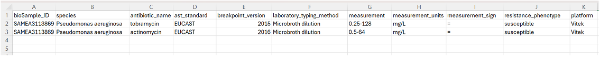

# AMR Search & Retrieval Guide for EMBL-EBI

## What is AMR data?

[Antimicrobial resistance (AMR)](https://www.who.int/news-room/fact-sheets/detail/antimicrobial-resistance) data are commonly presented in the form of [antibiograms](https://www.safetyandquality.gov.au/sites/default/files/2019-05/infosheet3-whatisanantibiogram.pdf), tables showing susceptibility of microbes particularly bacteria, to various antimicrobials (e.g. antibiotics, antivirals, antifungals, or antiparasitics). Antibiograms are a crucial piece of data in the fight against AMR in healthcare as they provide information on efficacy of treatments for different bacteria, and thus guide prescribing policies.

Antibiograms are also referred to as Antibiotic Susceptibility Test (AST) data, and are typically generated from bacteria isolated from patients.

## The AMR antibiogram format

A typical AMR antibiogram stored in EMBL-EBI resources (specifically, ENA or BioSamples) should follow the tabular format below, [as suggested by the COMPARE project in 2020](https://europepmc.org/article/MED/32255760).

***Fig. 1:** Example antibiogram format for ENA and BioSamples submission, developed as part of the COMPARE project*



The submitted antibiogram may specify some or all columns in Figure 1. [Example antibiogram](https://github.com/EBI-COMMUNITY/compare-amr/blob/master/validator/antibiogram_template.txt).

## How can you search for AMR antibiograms in EMBL-EBI?

AMR antibiograms can be searched in ENA and BioSamples databases, however the way this is captured differs across archives. Therefore, search and retrieval of this data will also differ.

An explanation of this, along with example queries/API endpoints for each database are presented below. Note that these are for search and retrieval of **public** metadata/data only.

### ENA

ENA stores antibiogram data as a `.txt` files within an [‘Analysis’ object](https://ena-docs.readthedocs.io/en/latest/submit/general-guide/metadata.html#metadata-model) (i.e `ERZ###`) using the `AMR_ANTIBIOGRAM` analysis type. [Example record](https://www.ebi.ac.uk/ena/browser/view/ERZ2186471)

**You can search for all antibiograms submitted directly to the ENA by:**

<https://www.ebi.ac.uk/ena/portal/api/search?result=analysis&fields=accession,analysis_type&query=analysis_type=%22AMR_ANTIBIOGRAM%22&limit=10>

**To restrict the search to antibiograms from a specific microbe (e.g. *E.coli*)**:

<https://www.ebi.ac.uk/ena/portal/api/search?result=analysis&fields=accession,analysis_type,tax_id&query=analysis_type=%22AMR_ANTIBIOGRAM%22%20AND%20tax_id=562&limit=10>

**N.B:** ENA (and BioSamples) use [NCBI taxonomy](https://www.ncbi.nlm.nih.gov/taxonomy) for classifying organisms.

**Or those from microbes collected in a particular country (e.g. UK):**

<https://www.ebi.ac.uk/ena/portal/api/search?result=analysis&fields=accession,analysis_type,tax_id,country&query=analysis_type=%22AMR_ANTIBIOGRAM%22%20AND%20tax_id=562%20AND%20country=%22United%20Kingdom%22&limit=10>

For a full list of searchable fields for the analysis domain:

<https://www.ebi.ac.uk/ena/portal/api/searchFields?result=analysis>

Genomic sequence data, whether raw reads or sequence assemblies and annotation, may also be associated to the antibiogram via the ‘Sample’ object.

To check this, **first retrieve the sample (i.e `SAM###`) accessions associated to the antibiograms of interest (e.g. *Salmonella enterica subsp. enterica serovar Typhimurium*):**

<https://www.ebi.ac.uk/ena/portal/api/search?result=analysis&fields=accession,analysis_type,tax_id,%20sample_accession&query=analysis_type=%22AMR_ANTIBIOGRAM%22%20AND%20tax_id=90371&limit=3>

Then search by sample, in each respective domain, by simply changing the `result=<domain>`  parameter. E.g.:

**Raw reads:**

<https://www.ebi.ac.uk/ena/portal/api/search?result=read_run&fields=accession,tax_id,sample_accession&query=sample_accession=%22SAMEA103950019%22%20or%20sample_accession=%22SAMEA103950020%22%20or%20sample_accession=%22SAMEA103950023%22>

You can also check for **other analysis types** (e.g. sequence annotations, other analysis products) **associated to the antibiogram samples:**

<https://www.ebi.ac.uk/ena/portal/api/search?result=analysis&fields=accession,tax_id,sample_accession,analysis_type&query=sample_accession=%22SAMEA103950019%22%20or%20sample_accession=%22SAMEA103950020%22%20or%20sample_accession=%22SAMEA103950023%22>

**N.B.:** Currently it is not possible to query the contents of an AMR antibiogram from ENA directly. The antibiograms would have to be downloaded locally and parsed.

**You can download AMR antibiograms per ENA analysis object, e.g.:**

```bash
wget -nc ftp://ftp.sra.ebi.ac.uk/vol1/analysis/ERZ218/ERZ2186471/*
```

Please note you would need to obtain a list of `AMR_ANTIBIOGRAM` analysis objects first.

It is also important to note, that due to differences in how this data is captured, ENA antibiograms are not mirrored to NCBI nor BioSamples. Thus going forward, the **formal recommendation is for antibiogram data to be submitted to BioSamples only.**

### BioSamples

The BioSamples archive stores AMR antibiogram data differently. Here it is represented directly in the BioSample record as a structured data table. See an example record [here.](https://www.ebi.ac.uk/biosamples/samples/SAMEA116133960)

The AMR antibiogram data stored in BioSamples comes from 2 sources:

1. Direct submissions to BioSamples
2. NCBI: as NCBI also stores antibiogram data in their sample records. NCBI samples have a `SAMN###` accession.  

See below for a breakdown of AMR antibiogram submissions to BioSamples.

**All AMR data within BioSamples:**  
<https://www.ebi.ac.uk/biosamples/samples?filter=attr:structured%20data:AMR>

**AMR data submitted directly to BioSamples only:**  
<https://www.ebi.ac.uk/biosamples/samples?filter=attr:structured%20data:AMR&filter=acc:SAME.*>

**AMR data imported from NCBI only:**  
<https://www.ebi.ac.uk/biosamples/samples?filter=attr:structured%20data:AMR&filter=acc:SAMN.*>

**To search for all AMR data from a particular organism:**  
<https://www.ebi.ac.uk/biosamples/samples?text=&filter=attr%3Aorganism%3AMycobacterium+tuberculosis&filter=attr:structured%20data:AMR>

**Searching for all AMR data from a particular country** is slightly more complex, as NCBI and BioSamples capture this information using a different field. NCBI uses: geo_loc_name whilst BioSamples follows ENA’s convention of: geographic location (country and/or sea).

Thus **two separate queries should be run**, and the resulting list of AMR samples merged i.e:

<https://www.ebi.ac.uk/biosamples/samples?filter=attr:structured%20data:AMR&filter=attr:geographic%20location%20(country%20and/or%20sea)>

and

<https://www.ebi.ac.uk/biosamples/samples?filter=attr:structured%20data:AMR&filter=attr:geo%20loc%20name>

Similarly to AMR data in ENA, it is not possible to query the contents of an AMR antibiogram from BioSamples records directly. The records containing the antibiograms have to be downloaded locally and parsed.

**To download specific AMR samples from BioSamples in JSON format**:

```bash
curl -o biosamples_data.json "https://www.ebi.ac.uk/biosamples/samples.json?filter=attr%3Aorganism%3AMycobacterium+tuberculosis&filter=attr:structured%20data:AMR"
```

You can use the BioSamples filters in the search endpoints above to further narrow down your query. Further details on building search queries in BioSamples can be found [at BioSample's search guide](https://www.ebi.ac.uk/biosamples/docs/guides/search). Note that BioSamples AMR data is not mirrored **to** ENA nor NCBI.
